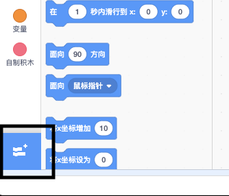
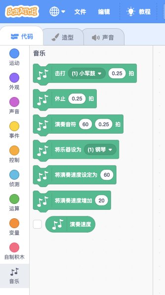

To use the Music blocks in Scratch, you need to add the **Music extension**.

+ 点击左下角的 **添加扩展** 按钮。

+ 点击 **音乐** 扩展以添加它。

+ 然后音乐积木就会出现在代码菜单的底部。

***
该项目由以下志愿者翻译：

[name]

[name]

[name]

正因为志愿者们的辛勤工作，我们才能为世界各地的人们提供用母语来学习的机会。您也可以通过志愿翻译工作来帮助我们吸引更多的人 - 更多信息，请访问[rpf.io/translate](https://rpf.io/translate)。
